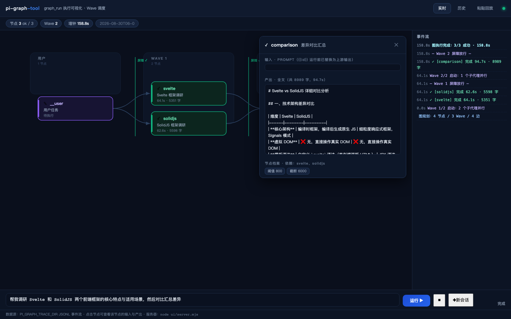

# pi-graph-tool

[English](./README.en.md) | **简体中文**

**面向 [Pi](https://pi.dev) 的图工程扩展：让 Agent 自主把子任务组织成 DAG——同波并行、跨波按依赖执行、节点间数据路由。**

```
你说：  "帮我调研 React、Vue、Svelte 三个框架，然后对比汇总给我"

Pi 做：  graph_run 提交 4 节点 DAG
              React ┐
              Vue   ├──（并行 Wave 1）──→ 对比汇总（Wave 2，引用三份调研结果）
              Svelte┘
```

## v0.2 新增：完整的 DAG 能力

v0.1 只能并行"互不依赖"的任务（一层、零条边的退化图）。v0.2 补齐三块核心能力：

| 能力 | 用法 | 说明 |
|---|---|---|
| **依赖声明** | `dependsOn: ["react", "vue"]` | 声明边；扩展做校验与环检测 |
| **多 Wave 调度** | 自动 | Kahn 拓扑分层，同波并行、波间屏障，自动推进 |
| **节点间数据路由** | prompt 中写 `{{react}}` | 运行前替换为上游节点输出；忘声明依赖会自动推断隐式边 |

另有 DAG 特有的**失败语义**：节点重试仍违约 → 其所有后代级联跳过（skipped），无关分支不受影响。

## 安装

```bash
# 从本仓库安装
pi install git:github.com/crazyMarky/pi-graph-tool

# 或 npm 发布后
pi install npm:pi-graph-tool
```

手动安装：

```bash
mkdir -p .pi/extensions
cp -r pi-graph-tool .pi/extensions/    # 项目级（推荐）
# 或拷到 ~/.pi/agent/extensions/ 全局生效
```

## 执行可视化（v0.2.4 新增，ui/ 目录）

把 `graph_run` 的执行过程——Wave 并行、屏障放行、违约重试、级联跳过——**实时画成图**。零依赖（纯 Node 内置模块 + 单文件页面），不用 npm install。



两个终端：

```bash
# 终端 1：任务侧（设置 PI_GRAPH_TRACE_DIR 后正常运行 pi 即可，对使用方式零侵入）
export PI_GRAPH_TRACE_DIR=/tmp/pgt-traces
cd <装了本扩展的项目>
pi "帮我调研 React、Vue、Svelte、Angular 四个框架，然后对比汇总"

# 终端 2：可视化
PI_GRAPH_TRACE_DIR=/tmp/pgt-traces node ui/server.mjs   # 打开 http://localhost:8788
```

页面能力（实时优先，历史为辅）：

- **底部输入框直接对话**：页面输入任务 → 服务器经持久 rpc 桥发送给 pi（**多轮连续对话**，⏹ 中止 / ✚ 新会话=画布清空重开）；**用户提示词渲染为图的根节点**（紫色 ✎，连线指向第一波），完成后自动展开最大 Wave 完成节点的全文产出作为结果
- **节点过程实时流**：运行中的节点在卡片上实时显示"已生成 N 字 / 最近工具"；点开节点可看**实时增量流**（文本逐段出现、工具调用次序），完成后切换为**产出全文（不截断）**；输入 prompt（`{{id}}` 注入后版本）随时可查
- **结构实时生长**：节点按 Wave 分列出现、运行节点蓝色脉冲、活动边流动虚线、波间屏障完成后变绿放行；隐式推断边（琥珀虚线）与显式边区分；违约→挽回重试徽标；失败级联灰化 + 原因
- **历史/离线**：切换任意已落盘 run（支持 4x 时序重放）；或粘贴 `details` JSON 离线重建
- 测试提示词集见 [`ui/PROMPTS.md`](ui/PROMPTS.md)：**自主规划型**（只给目标，图的形状由模型现场决定）+ 受控观测型（压测调度语义），并说明单次调用的静态 DAG 与多轮"规划→执行→再规划"动态循环的边界

注意：trace 含各节点 prompt 与产出全文，目录内容请勿外传。

追踪设计：默认关闭（不设 `PI_GRAPH_TRACE_DIR` 零开销零副作用）；事件以 JSONL 追加落盘（`plan / wave_start / node_ok / violation / retry_start / skip / wave_end / done`）；全程 try/catch 包裹，追踪通道异常绝不影响图执行本身。

## 验证安装

1. **存在性**：启动 `pi`，问它 *"你有哪些工具？graph_run 是干什么的？"*
2. **行为性**：提出"调研 A、B、C 再汇总"，终端出现 `[graph_run] 图规划完成：4 个节点 / 2 个 Wave / 3 条边` 日志
3. **效果性**：同一批任务串行 vs DAG 对照计时

## 参数协议

`graph_run` 接收一个 `subtasks` 数组，每个元素是一个 DAG 节点：

| 字段 | 必填 | 说明 |
|---|---|---|
| `id` | 否 | 节点唯一短 id（如 `"react"`）；省略时默认 `n1`、`n2`…。`dependsOn` 和 `{{id}}` 都引用它 |
| `title` | 是 | 子任务短名，用于结果展示 |
| `prompt` | 是 | 给该子代理的完整独立指令（需自包含背景）。可含 `{{id}}` 占位符，运行前替换为上游输出 |
| `dependsOn` | 否 | 依赖的上游节点 id 数组；上游全部成功后本节点才执行 |
| `tools` | 否 | **v0.2.3** 该子代理的工具白名单（如 `["read","bash"]`）。省略 = 纯 LLM 无工具（默认，快且省 token）；需要读文件/执行命令的节点才声明。`graph_run` 永远不可用（白名单不含 + `excludeTools` 双保险，防递归） |
| `workdir` | 否 | **v0.2.3** 该子代理的工作目录（相对当前目录）。声明了 `tools` 的节点建议设置，避免并行工具节点互相踩踏文件 |
| `minOutputChars` | 否 | **v0.2.3** 该节点的最小输出字符数（默认 20）。视觉判定/是否类等天然简短的任务设 `0` 豁免。阈值只触发一次挽回重试，重试后非空即接受，不会丢弃节点 |
| `outputCap` | 否 | **v0.2.3** 该节点回传主上下文的截断字符数（默认 6000）；`0` = 不截断。汇总节点可调大、判定节点可调小 |

示例——三路调研 + 一路汇总：

```json
{
  "subtasks": [
    { "id": "react",  "title": "调研 React",  "prompt": "调研 React 最新生态：核心特性、优势、风险，输出 300 字左右摘要。" },
    { "id": "vue",    "title": "调研 Vue",    "prompt": "调研 Vue 最新生态：核心特性、优势、风险，输出 300 字左右摘要。" },
    { "id": "svelte", "title": "调研 Svelte", "prompt": "调研 Svelte 最新生态：核心特性、优势、风险，输出 300 字左右摘要。" },
    {
      "id": "compare",
      "title": "对比汇总",
      "prompt": "以下是三个前端框架的调研结果，请横向对比并给出选型建议：\nReact：{{react}}\nVue：{{vue}}\nSvelte：{{svelte}}",
      "dependsOn": ["react", "vue", "svelte"]
    }
  ]
}
```

执行形态：Wave 1 = React/Vue/Svelte 三路并行 → 全部履约 → Wave 2 = 汇总节点拿到三份注入的调研结果。

省略全部 `dependsOn` 时退化为 v0.1 的单波并行——完全向后兼容。

**v0.2.3 节点档案示例**——同一张图里，不同节点按需声明工具/阈值/截断：

```json
{
  "subtasks": [
    { "id": "qa",   "title": "图片判定", "prompt": "判定图片是否有数字，只回答：有/无", "minOutputChars": 0 },
    { "id": "dev",  "title": "读代码",   "prompt": "读取 src/api.py，总结其公开接口",     "tools": ["read"], "workdir": "nodes/dev" },
    { "id": "rpt",  "title": "长报告",   "prompt": "写一份 800 字架构评审报告",           "outputCap": 8000 }
  ]
}
```

挽回语义（v0.2.3）：输出短于阈值只触发**一次**挽回重试——首答为空则轻推一句让它开口；首答非空但短则用**原题**重试（不改写指令，避免与"简洁类"任务自相矛盾），从两次结果中取更优。重试后仍非空即接受，不丢弃节点（修复视觉判定类任务被 20 字符阈值误杀的问题）。

## 工作原理

```
graph_run({ subtasks })
   │
   ▼
① 图规划
   ├─ id 归一与查重、dependsOn 引用校验（未知 id / 自依赖即报错）
   ├─ 隐式边推断：prompt 引用了 {{id}} 却没声明依赖 → 自动补边
   └─ Kahn 拓扑分层成 Wave（发现环 → 报错让 LLM 修正后重新调用）
   │
   ▼
② Wave 主循环（w = 1..N）
   ├─ 失败级联：上游未成功的节点 → skipped（传递性，不浪费 API 配额）
   ├─ Fan-out：本波节点各起一个进程内 Pi 子代理（独立会话上下文）
   │          prompt 中的 {{id}} 已替换为上游输出（数据路由，带截断）
   ├─ Barrier：Promise.allSettled 等本波全部落定（单点崩溃不击穿屏障）
   └─ 契约校验：违约节点（空输出 / 崩溃 / 超时）单独隔离重试一次
   │
   ▼
③ 聚合返回
   └─ 按 Wave 分组、每节点截断回传主上下文（轻量引用，默认 6000 字符可调）
```

### 图工程概念与代码对照

| 图工程概念 | 实现 |
|---|---|
| DAG 声明（节点 + 边） | `subtasks[].dependsOn` 显式边 + `{{id}}` 占位符隐式边 |
| 拓扑分层（Wave 调度） | Kahn 算法反复取出"依赖就绪"的节点 |
| Fan-out + Barrier | Wave 内 `Promise.allSettled` |
| 节点间数据路由 | `{{id}}` → 上游输出注入（默认全保真，仅病态输出截断护栏） |
| 失败级联 | 上游非 ok → 所有后代标记 skipped |
| 节点契约 | 输出 >20 字符；违约只重跑该节点，不重跑整波 |
| 轻量引用 | 每节点回传默认截断至 6000 字符（`PI_GRAPH_OUTPUT_CAP` 可调，0 = 不截断） |
| 上下文隔离 | 每节点独立子代理会话（纯内存、不落盘、不污染 `pi --resume` 会话列表），token 不进主上下文 |
| 递归防护 | 子代理 `noTools: "all"`，结构上无法再调 graph_run |

### 环境变量

| 变量 | 默认值 | 说明 |
|---|---|---|
| `PI_GRAPH_NODE_TIMEOUT_MS` | `300000` | 单节点超时（毫秒），超时按违约处理 |
| `PI_GRAPH_ROUTE_CAP` | `100000` | 注入下游 prompt 时单个上游输出的截断长度。默认全保真，仅防病态超长输出；`0` = 不截断 |
| `PI_GRAPH_OUTPUT_CAP` | `6000` | 节点结果回传主上下文的截断长度；`0` = 不截断（每节点可用 `outputCap` 覆盖） |
| `PI_GRAPH_MIN_OUTPUT_CHARS` | `20` | **v0.2.3** 节点契约阈值（触发挽回重试的长度线）；每节点可用 `minOutputChars` 覆盖 |
| `PI_GRAPH_MODEL_JSON` | — | 完整 Model 对象 JSON，覆盖子代理模型 |

> 截断策略说明：**数据路由（上游→下游）默认全保真**——下游子代理的上下文是隔离且全新的，截断上游输出会直接破坏流水线语义。**回传主上下文**保持轻量引用（保护主对话窗口），但默认放宽到 6000 字符；若节点很多导致主上下文紧张，可调小或设 0。控制信息量的更好方式是在节点 prompt 里直接约束输出长度（如"输出 300 字摘要"）。

模型解析优先级：`PI_GRAPH_MODEL_JSON` → 项目 `.pi-agent/` → 全局 `~/.pi/agent`（跟随你平时用的模型与密钥，零硬编码）。

## 实测收益（v0.1 并行基准，智谱 GLM-4.5）

| 规模 | 串行 | 并行 | 加速比 |
|------|:---:|:---:|:---:|
| 3 个子任务 | 57-60s | 40s | **1.44x** |
| 6 个子任务 | 117s | 53s | **2.20x** |

多 Wave 流水线（如上面的 3+1 结构）额外收益来自：汇总节点不再空等串行队列，而是在三路调研落定后立即带上下文启动。

## 限制（如实说明）

- **GLM-4.5 已知怪癖**：间歇性返回空内容；工具调用后的收尾消息常为空（工具白名单功能本身正常，DeepSeek 环境经组内测评验证工具节点工作良好）。重要任务前建议先小规模试跑

- 子代理是纯 LLM（无工具）——适合调研 / 生成 / 对比类任务；需要工具的节点需放开 `noTools`
- 波间是屏障语义：Wave 2 必须等 Wave 1 全部落定——这是保证依赖就绪的代价，也是 DAG 调度的标准行为
- LLM 检测到依赖关系时会自主选择分波结构（特性）；可用"用 graph_run"强制
- 建议单次 ≤12 个子任务（API 限流护栏，超出会被拒绝）
- GLM-4.5 实测；Claude / OpenAI 理论兼容（零硬编码）但未测

## 性能基准（可自行复测）

`bench/` 目录提供 A/B 基准脚本：串行（单会话逐个处理，无扩展等价）vs 图调度（复刻本扩展的 Wave 并行 + 数据路由）：

```bash
cd bench
npm install
node bench.mjs
```

脚本会输出两方案的总耗时、加速比，以及一个关键判据——**Wave 1 最慢节点耗时**：若它接近"串行单耗 × 任务数"，说明你的账号/模型在服务商侧被排队，并行收益趋近 0；若接近"串行单耗"，并发是真的。参考值（GLM-4.5，小任务）：加速比 1.63x，Wave 1 最慢节点 4.2s vs 串行单耗 3.4s。

## License

[MIT](./LICENSE)
